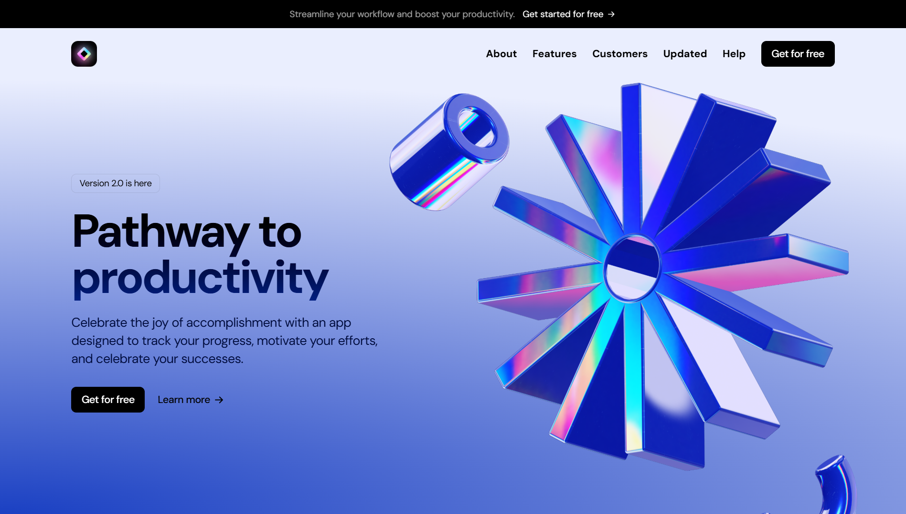

<h3 align="center">SaaS Landing Page | Concluído :white_check_mark:</h3>

---

## Sobre o projeto :computer:

Uma landing page de um Software as a Service (SaaS) desenvolvida por fins de estudos, aprimorando minhas habilidades de design,
posicionamento de imagens absolutas, responsividade, criação de componentes reutilizáveis e, utilizando pela primeira vez, 
o Framer Motion para adicionar animações e efeitos na página.

---

## Tecnologias usadas :star:

- [x] NextJS
- [x] ReactJS
- [x] TailwindCSS
- [x] TypeScript
- [x] Framer Motion

---

  
  
  
  
  

---

## Demo :camera:

---

## Autor :raising_hand:

<b>Henry Nicollas Issicaba Neves</b>

  

